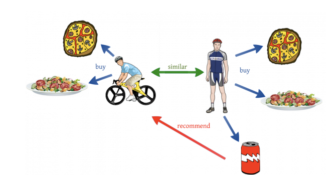
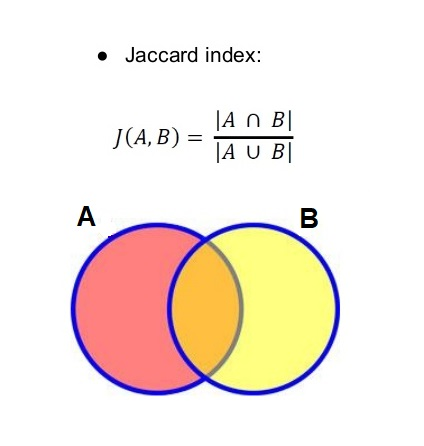
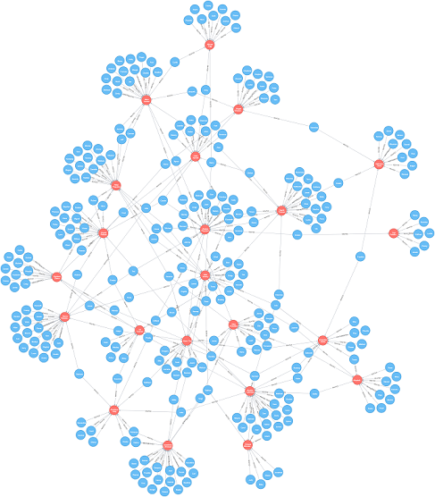

Collaborative Filtering Recommender System 
================

Building a Recommendation Engine with Neo4j & Python
----------------------------------------------------

In a [previous post](https://github.com/MNoorFawi/neo4j-and-postgresql-with-R), we created a **graph database** in **Neo4j** using **DVDRENTAL** database which can be downloaded from <http://www.postgresqltutorial.com/wp-content/uploads/2017/10/dvdrental.zip>.

Here, we will continue our work and try to build a **Recommender System** using **cypher**, the query language of Neo4j through **python**.

Our system will recommend movies to target users based on the preferences of the users that seem to have a similar taste of movies. i.e., for each target user we will identify the most similar users to them and preferences of these simialr users are then used to generate recommendations for the target user.

This algorithm is known as **Collaborative Filtering**



###### [Image source](https://towardsdatascience.com/various-implementations-of-collaborative-filtering-100385c6dfe0)

Collaborative filtering (CF) is a technique commonly used to build personalized recommendation systems. Some popular websites that use CF technology include Amazon, Netflix, and IMDB. In CF, predictions about a user's interests are made by compiling preferences from similar users.

In order to build our recommender system, there are steps that need to be followed: 1) Select a similarity metric to quantify similarity among users in data. 2) For each target user, compute similarity between them and the rest of users. 3) Select the top k nearest neighbors based on the similarity metric. 4) Identify Movies rented by the top k neighbors that have not been rented by the target user. 5) Rank these movies by the number of renting neighbors. 6) Recommend the top n movies to the target user.

The similarity metric we will use here is **Jaccard Similarity Coefficient** or **Jaccard Index** also known as Intersection over Union.



Jaccard Index between two sets A and B is the ratio of the number of elements in the intersection of A and B over the number of elements in the union of A and B.

We will also use 25 nearest neighbors to recommend 5 movies to the target user.

Let's get down to business ...

This is how our customers and the movies they have rented look like in our graph database.



Let's now run our database and connect it to python and do some query to get the number of movies per each genre.

###### from command line run **neo4j console**

``` python
from py2neo import authenticate, Graph
authenticate("localhost:7474", "username", "password") 
g = Graph("http://localhost:7474/db/data/")

query = """
MATCH (cat:Category)<-[g:OF_GENRE]-()
RETURN cat.Name AS genre, COUNT(g) AS number_of_movies
ORDER BY number_of_movies DESC;
"""
g.cypher.execute(query)

    | genre       | number_of_movies
----+-------------+------------------
  1 | Sports      |               74
  2 | Foreign     |               73
  3 | Family      |               69
  4 | Documentary |               68
  5 | Animation   |               66
  6 | Action      |               64
  7 | New         |               63
  8 | Drama       |               62
  9 | Games       |               61
 10 | Sci-Fi      |               61
 11 | Children    |               60
 12 | Comedy      |               58
 13 | Travel      |               57
 14 | Classics    |               57
 15 | Horror      |               56
 16 | Music       |               51
```

Now that we have everything configured, let's choose some random user and try to make recommendations for them. We will first get the most similar users to our target user, the Jaccard Index, Movies in common (Intersection), Movies in total (Union) .

``` python
query = """
        // get target user and their neighbors pairs and count 
        // of distinct movies that they have rented in common
        MATCH (c1:Customer)-[:RENTED]->(f:Film)<-[:RENTED]-(c2:Customer)
        WHERE c1 <> c2 AND c1.customerID = {cid}
        WITH c1, c2, COUNT(DISTINCT f) as intersection

        // get count of all the distinct movies that they have rented in total (Union)
        MATCH (c:Customer)-[:RENTED]->(f:Film)
        WHERE c in [c1, c2]
        WITH c1, c2, intersection, COUNT(DISTINCT f) as union

        // compute Jaccard index
        WITH c1, c2, intersection, union, (intersection * 1.0 / union) as jaccard_index
        
        // get top k nearest neighbors based on Jaccard index
        ORDER BY jaccard_index DESC, c2.customerID
        WITH c1, COLLECT([c2.customerID, jaccard_index, intersection, union])[0..{k}] as neighbors
     
        WHERE LENGTH(neighbors) = {k}   // return users with enough neighbors
        RETURN c1.customerID as customer, neighbors
        """

neighbors = {}
for i in g.cypher.execute(query, cid = "13", k = 25):
    neighbors[i[0]] = i[1]

print("# customer13's 25 nearest neighbors: customerID, jaccard_index, intersection, union")
display(neighbors)

# customer13's 25 nearest neighbors: customerID, jaccard_index, intersection, union
{'13': [['93', 0.08695652173913043, 4, 46],
  ['211', 0.07142857142857142, 4, 56],
  ['379', 0.06521739130434782, 3, 46],
  ['578', 0.06521739130434782, 3, 46],
  ['134', 0.06382978723404255, 3, 47],
  ['8', 0.06382978723404255, 3, 47],
  ......
  ['464', 0.05, 2, 40],
  ['555', 0.047619047619047616, 2, 42]]}
```

Now let's see the top 5 movies that we can recommend to our target user and how many of their nearest neighbors have rented these movies ...

``` python
# get the list of the nearest neighbors IDs
nearest_neighbors = [neighbors["13"][i][0] for i in range(len(neighbors["13"]))]

query = """
        // get top n recommendations for customer 13 from their nearest neighbors
        MATCH (c1:Customer),
              (neighbor:Customer)-[:RENTED]->(f:Film)    // all movies rented by neighbors
        WHERE c1.customerID = {cid}
          AND neighbor.customerID in {nearest_neighbors}
          AND not (c1)-[:RENTED]->(f)                    // filter for movies that our user hasn't rented
        
        WITH c1, f, COUNT(DISTINCT neighbor) as countnns // times rented by nns
        ORDER BY c1.customerID, countnns DESC               
        RETURN c1.customerID as customer, COLLECT([f.Title, countnns])[0..{n}] as recommendations  
        """

recommendations = {}
for i in g.cypher.execute(query, cid = "13", nearest_neighbors = nearest_neighbors, n = 5):
    recommendations[i[0]] = i[1]
    
print("# customer13's recommendations: Movie, number of rentals by neighbors")
display(recommendations)

# customer13's recommendations: Movie, number of rentals by neighbors
{'13': [['Goodfellas Salute', 5],
  ['Pacific Amistad', 4],
  ['Streetcar Intentions', 4],
  ['Chill Luck', 4],
  ['Whisperer Giant', 4]]}
  
```

VERY NICE! Now we have successfully built our Recommender System that can recommend movies to target customers. Let's now write it in a script that can be run in the command line using customer IDs as arguments and return recommendations per customer ...

``` python
## Our Recommender System Script (dvd_recommender.py)
import sys
from py2neo import authenticate, Graph

cid = sys.argv[1:]

authenticate("localhost:7474", "username", "password") 
g = Graph("http://localhost:7474/db/data/")

def cf_recommender(graph, cid, nearest_neighbors, num_recommendations):

    query = """
           MATCH (c1:Customer)-[:RENTED]->(f:Film)<-[:RENTED]-(c2:Customer)
           WHERE c1 <> c2 AND c1.customerID = {cid}
           WITH c1, c2, COUNT(DISTINCT f) as intersection
           
           MATCH (c:Customer)-[:RENTED]->(f:Film)
           WHERE c in [c1, c2]
           WITH c1, c2, intersection, COUNT(DISTINCT f) as union

           WITH c1, c2, intersection, union, 
              (intersection * 1.0 / union) as jaccard_index

           ORDER BY jaccard_index DESC, c2.customerID
           WITH c1, COLLECT(c2)[0..{k}] as neighbors
           WHERE LENGTH(neighbors) = {k}                                              
           UNWIND neighbors as neighbor
           WITH c1, neighbor

           MATCH (neighbor)-[:RENTED]->(f:Film)         
           WHERE not (c1)-[:RENTED]->(f)                        
           WITH c1, f, COUNT(DISTINCT neighbor) as countnns
           ORDER BY c1.customerID, countnns DESC                            
           RETURN c1.customerID as customer, 
              COLLECT(f.Title)[0..{n}] as recommendations      
           """

    recommendations = {}
    # cid = [str(c) for c in cid]
    for c in cid:
        for i in graph.cypher.execute(query, cid = c, k = nearest_neighbors, n = num_recommendations):
            recommendations[i[0]] = i[1]
    return recommendations

print(cf_recommender(g, cid, 25, 5))
```

Run the system from command line ...

``` bash
$ python dvd_recommender.py 13 11 19 91 

{'13': ['Goodfellas Salute', 'Pacific Amistad', 'Streetcar Intentions', 'Chill Luck', 'Whisperer Giant'],
 '11': ['Sweethearts Suspects', 'Tights Dawn', 'Island Exorcist', 'Jason Trap', 'Earth Vision'],
 '19': ['Fatal Haunted', 'Crossroads Casualties', 'Ridgemont Submarine', 'Wonderland Christmas', 'Uptown Young'],
 '91': ['Forrester Comancheros', 'Anaconda Confessions', 'Bear Graceland', 'Greatest North', 'Hanover Galaxy']}
```
